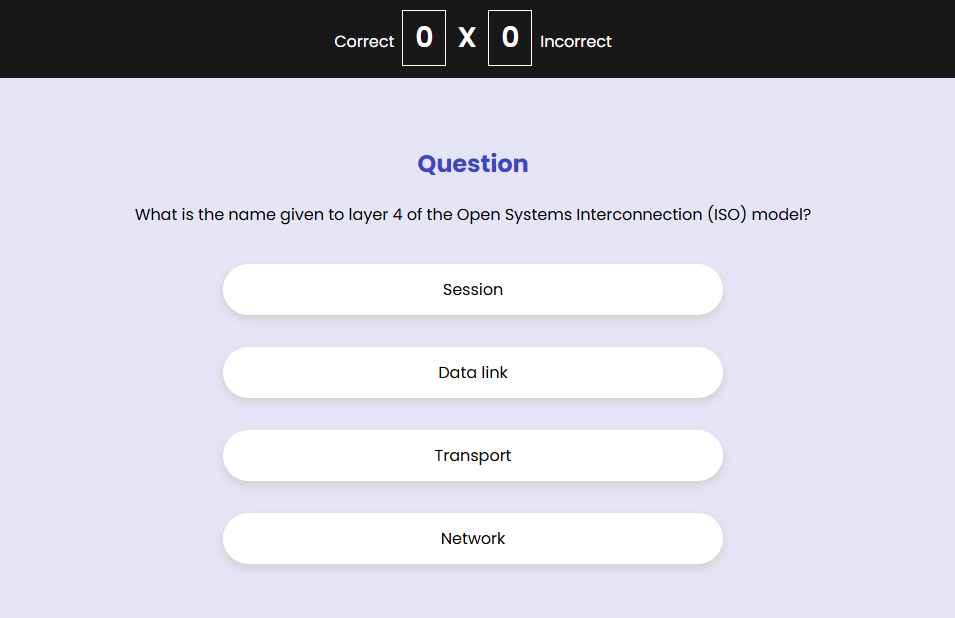

# 🎓 Quiz de TI - OpenTDB



Bem-vindo ao **Quiz de TI**, uma aplicação interativa que testa seus conhecimentos sobre tópicos de TI e outros temas variados, com perguntas retiradas da [API Open Trivia Database (OpenTDB)](https://opentdb.com/). Este projeto foi desenvolvido com **React**, **TypeScript** e **Sass** para criar uma experiência de quiz divertida e educacional.

## 🚀 Funcionalidades

- **Perguntas Dinâmicas**: As perguntas são carregadas diretamente da API OpenTDB, proporcionando uma experiência sempre nova.
- **Múltiplos Tipos de Pergunta**: Além de perguntas de múltipla escolha, o quiz também apresenta questões de verdadeiro/falso.
- **Placar em Tempo Real**: Veja suas respostas corretas e incorretas atualizarem em tempo real.
- **Interface Atraente e Responsiva**: Layout projetado para dispositivos móveis e desktops.

## 🛠 Tecnologias Utilizadas

- **React** - Biblioteca JavaScript para construção de interfaces de usuário.
- **TypeScript** - Superset de JavaScript com tipagem estática.
- **Sass** - Extensão CSS que adiciona poder e elegância à sintaxe CSS.
- **Open Trivia Database (OpenTDB)** - API gratuita de perguntas para quizzes.

## 📦 Pré-requisitos

- **Node.js**, **npm** (ou **Yarn**) e **Vite** instalados.

## 🚀 Instalação e Uso

1. **Clone o repositório**:
   ```bash
   git clone https://github.com/SeuUsuario/nome-do-repositorio.git
   cd nome-do-repositorio

2. **Instale as dependências**:
    ```bash
    npm install
    # ou
    yarn install

3. **Inicie o servidor de desenvolvimento**:
    ```bash
    vite

4. **Acesse o aplicativo no navegador**:
    
    Abra a URL gerada para visualizar o quiz.

## 🎮 Como Jogar

Acesse: https://vitorhso.github.io/quiz-game/

1. A cada início, uma nova pergunta será exibida, gerada aleatoriamente a partir da API OpenTDB.

2. Escolha a resposta correta entre as opções disponíveis.

3. Seu placar será atualizado automaticamente, exibindo o número de respostas corretas e incorretas.

4. Continue jogando até atingir seu melhor desempenho!


